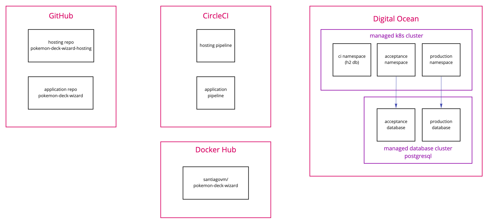

# Pokemon Deck Wizard

This is a PoC to demonstrate what is required to have a Spring Boot Application deployed
to a Kubernetes cluster.

I am using the following infrastructure:

- GitHub: code repositories
- CircleCI: CI/CD
- DockerHub: docker images registry
- Digital Ocean: managed k8s cluster and managed database service

## ci/cd configuration files

- Dockerfile
- CircleCI: `.circleci/config.yml`
- k8s Manifest: `.k8s/manifest-templates/ci.yml`

## ship-it script dependencies

- shellcheck: to lint bash scripts

## local k8s deployment dependencies

- local docker engine
- local k8s cluster

## lessons learned

- run k8s manifest against local k8s cluster to find basic problems. Feedback loop is too long 
when going all the way to the CI/CD pipeline and finding many little problems one at a time.

- to get kubectl autocompletion
  - [upgrade bash in macos](https://itnext.io/upgrading-bash-on-macos-7138bd1066ba)
  - [setup autocompletion](https://learnk8s.io/blog/kubectl-productivity#bash-on-macos)

## circle ci env variables

### Docker Hub Registry

- DOCKER_ACCOUNT
- DOCKER_PASS
- DOCKER_USER

### Kubernetes Cluster

- K8S_ACCESS_TOKEN
- K8S_CLUSTER_SERVER
